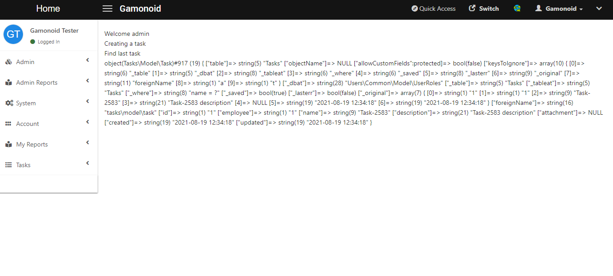

# Adding entries to the database

## Introduction
Now we can add data to the table we created.

### Add a model class

A model is required to communicate with the database. 

***Gamonoid uses AdoDB as the ORM. But it provides an abstraction layer on top of AdoDB.***

The `Task.php` file should be in `extensions/tasks/src/Tasks/Model

```text
📦extensions
 ┣ 📂tasks
 ┃ ┣ 📂src
 ┃ ┃ ┗ 📂Tasks
 ┃ ┃ ┃ ┣ 📂Model
 ┃ ┃ ┃ ┃ ┗ 📜Task.php
 ┃ ┃ ┃ ┣ 📜Extension.php
 ┃ ┃ ┃ ┗ 📜Migration.php
 ┃ ┣ 📂web
 ┃ ┃ ┗ 📜index.php
 ┃ ┣ 📜meta.json
 ┃ ┗ 📜tasks.php
 ┗ 
 ```
 `Task.php` should look like:
 ```php
<?php

namespace Tasks\Model;

use Classes\ModuleAccess;
use Model\BaseModel;

class Task extends BaseModel
{
    public $table = 'Tasks';
}
```
### Updating the extension include file

Update the **tasks.php** file:

```text
<?php
require_once __DIR__.'/src/Tasks/Extension.php';
require_once __DIR__.'/src/Tasks/Migration.php';
require_once __DIR__.'/src/Tasks/Model/Task.php';
```
### Create a task

Now we will create a random task on the view file and print it on the screen to test whether the extension is working.

Update the `web/index.php` file:

```php
<?php
$user = \Classes\BaseService::getInstance()->getCurrentUser();
echo "Welcome ".$user->username."<br/>";

echo "Creating a task <br/>";

$task = new \Tasks\Model\Task();
$taskName = 'Task-'.rand(rand(0, 100), 50000);

$task->name = $taskName;
$task->employee = $user->employee;
$task->description = $taskName.' description';
$task->created = date('Y-m-d H:i:s');
$task->updated = date('Y-m-d H:i:s');

/**
 * Saving the task, $ok will be false if there were any error during the creation
 */
$ok = $task->Save();

if (!$ok) {
    echo "Error: ".$task->ErrorMsg()." <br/>";    
}

echo "Find last task <br/>";

$taskFromDB = new \Tasks\Model\Task();
/**
 * You can use load method to load the first matching task into an empty model
 */
$taskFromDB->Load('name = ?', [$taskName]);

var_dump($taskFromDB);
```
The page should look like this after you reload the page:



